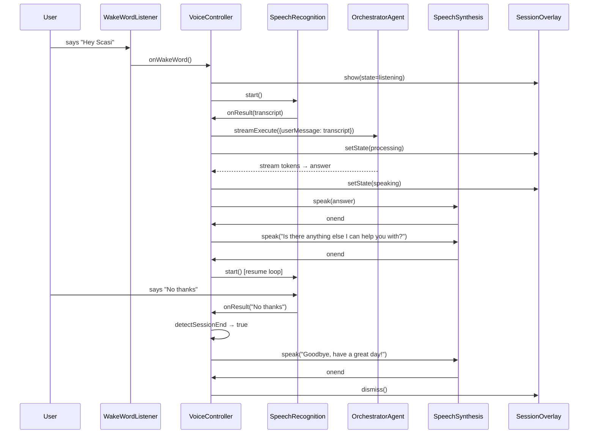
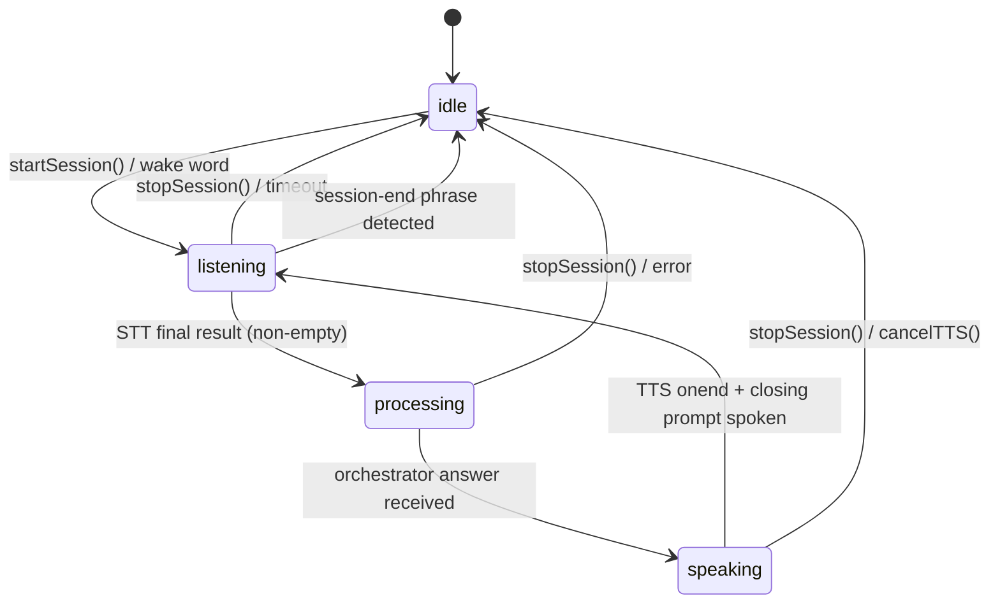

# Design Document: Scasi Voice Assistant

## Overview

This document covers the technical design for three integrated features: the Scasi Voice Agent (hands-free inbox control via Web Speech API), the Evaluation & Testing Agent (LLM-as-judge pipeline with a `/test-dashboard`), and a set of Polish & Integration improvements (Handle For Me, Follow-Up Tracker, error boundaries, loading states).

The voice agent wires the browser's `SpeechRecognition` and `SpeechSynthesis` APIs into the existing `OrchestratorAgent.streamExecute()` pipeline. The eval agent adds a server-side scoring framework using OpenRouter (Qwen) as an LLM judge against Groq (Llama) outputs. Polish work adds missing UX affordances across the dashboard.

---

## Architecture

### High-Level Component Diagram

```mermaid
graph TD
    subgraph Browser
        WW[WakeWordListener\ncontinuous SpeechRecognition]
        VC[VoiceController\nReact hook]
        MB[MicButton\nTopNavbar]
        SO[SessionOverlay\nFramer Motion]
        STT[SpeechRecognition API]
        TTS[SpeechSynthesis API]
    end

    subgraph Next.js App
        OA[OrchestratorAgent\nstreamExecute]
        RE[/api/actions/run-evals\nPOST route]
        EA[EvalAgent\nLLM-as-judge]
        TD[/test-dashboard\npage]
    end

    subgraph External
        GROQ[Groq\nLlama — NLP]
        OR[OpenRouter\nQwen — Judge]
        SB[Supabase\neval_runs table]
    end

    WW -->|wake word detected| VC
    MB -->|click| VC
    VC -->|transcript| OA
    OA -->|streamExecute| GROQ
    OA -->|answer text| VC
    VC -->|speak| TTS
    VC -->|state| MB
    VC -->|state| SO
    STT -->|transcript| VC

    RE --> EA
    EA --> GROQ
    EA --> OR
    EA --> SB
    TD --> RE
```

### Voice Session Data Flow



---

## Components and Interfaces

### Voice Agent — `src/agents/voice/`

#### `VoiceController` hook — `src/agents/voice/useVoiceController.ts`

The central client-side hook that owns the voice session state machine.

```typescript
type VoiceState = 'idle' | 'listening' | 'processing' | 'speaking';

interface VoiceControllerOptions {
  sessionId?: string;
  onTranscript?: (text: string) => void;
  onAnswer?: (text: string) => void;
  onStateChange?: (state: VoiceState) => void;
  onError?: (error: VoiceError) => void;
}

interface VoiceControllerReturn {
  state: VoiceState;
  startSession: () => void;
  stopSession: () => void;
  cancelTTS: () => void;
  isSupported: { stt: boolean; tts: boolean };
}

function useVoiceController(options: VoiceControllerOptions): VoiceControllerReturn;
```

#### `WakeWordListener` — `src/agents/voice/wakeWordListener.ts`

Lightweight background `SpeechRecognition` instance that only looks for "Hey Scasi". Runs continuously while the user is authenticated. Detection is entirely client-side — no audio leaves the browser.

```typescript
interface WakeWordListenerOptions {
  onDetected: () => void;
  wakePhrase?: string; // default: "hey scasi"
}

class WakeWordListener {
  constructor(options: WakeWordListenerOptions);
  start(): void;
  stop(): void;
  readonly isSupported: boolean;
}
```

#### Voice Session State Machine



#### `VoiceError` type

```typescript
type VoiceErrorCode =
  | 'STT_UNSUPPORTED'
  | 'TTS_UNSUPPORTED'
  | 'MIC_DENIED'
  | 'ORCHESTRATOR_ERROR'
  | 'SESSION_TIMEOUT';

interface VoiceError {
  code: VoiceErrorCode;
  message: string;
}
```

### Voice Components — `components/voice/`

#### `MicButton` — `components/voice/MicButton.tsx`

Rendered inside `TopNavbar`. Reflects `VoiceState` via visual variants.

```typescript
interface MicButtonProps {
  state: VoiceState;
  onClick: () => void;
  isSupported: boolean;
}
```

| State | Visual |
|---|---|
| `idle` | Static mic icon |
| `listening` | Pulse ring animation (Framer Motion) |
| `processing` | Spinner / loading indicator |
| `speaking` | Waveform bars animation |
| unsupported | Disabled with tooltip |

#### `SessionOverlay` — `components/voice/SessionOverlay.tsx`

Siri-style rounded square overlay. Uses Framer Motion `AnimatePresence` for mount/unmount transitions. Three wave ring variants driven by `VoiceState`.

```typescript
interface SessionOverlayProps {
  state: VoiceState;
  isVisible: boolean;
  onDismiss: () => void;
}
```

Wave ring animation variants:
- `listening` — slow, gentle pulse rings
- `processing` — rotating arc indicator
- `speaking` — fast, energetic expanding rings

### Eval Agent — `src/agents/testing/`

#### `EvalAgent` — `src/agents/testing/evalAgent.ts`

```typescript
interface EvalRunResult {
  runId: string;
  timestamp: string;
  promptHashes: Record<string, string>; // agentName → SHA-256
  perEntryResults: EvalEntryResult[];
  categoryPassRates: CategoryPassRates;
  overallPassRate: number;
  regressionFlags: RegressionFlag[];
}

interface EvalEntryResult {
  emailId: string;
  priorityAccuracy: JudgeVerdict;
  replyQuality: JudgeVerdict;
  summaryCompleteness: JudgeVerdict;
  ragRetrievalPrecision: JudgeVerdict;
}

interface JudgeVerdict {
  pass: boolean;
  score: number; // 0–1
  reasoning: string;
}

interface CategoryPassRates {
  priorityAccuracy: number;
  replyQuality: number;
  summaryCompleteness: number;
  ragRetrievalPrecision: number;
}

interface RegressionFlag {
  category: keyof CategoryPassRates;
  previousRate: number;
  currentRate: number;
  delta: number;
}

class EvalAgent {
  async runEvals(): Promise<EvalRunResult>;
  private judgeEntry(email: EvalEmail, outputs: AgentOutputs): Promise<EvalEntryResult>;
  private computePromptHashes(): Record<string, string>;
  private detectRegressions(current: CategoryPassRates): Promise<RegressionFlag[]>;
  private persistRun(result: EvalRunResult): Promise<void>;
}
```

#### Eval Dataset — `src/agents/testing/eval-dataset.ts`

```typescript
const EvalEmailSchema = z.object({
  id: z.string(),
  subject: z.string(),
  from: z.string(),
  body: z.string(),
  expectedPriority: z.number().min(1).max(10),
  expectedCategory: z.enum(['job_offer', 'meeting_request', 'billing', 'spam', 'personal', 'newsletter', 'support']),
  expectedSummaryKeywords: z.array(z.string()),
  expectedReplyTone: z.enum(['professional', 'friendly', 'formal', 'none']),
});

type EvalEmail = z.infer<typeof EvalEmailSchema>;

export const EVAL_DATASET: EvalEmail[]; // 10–15 entries
```

### Dashboard Components

#### `EmailCard` updates — `components/dashboard/EmailCard.jsx`

Add a "Handle For Me" button with three states: idle, loading, success/error. Button is always visible on mobile, hover-visible on desktop.

```typescript
interface HandleForMeState {
  status: 'idle' | 'loading' | 'success' | 'error';
  result?: string;
  error?: string;
}
```

#### `FollowUpTracker` — `components/dashboard/FollowUpTracker.tsx`

Collapsible sidebar section backed by the existing `follow_ups` Supabase table (migration 004).

```typescript
interface FollowUpItem {
  id: string;
  subject: string;      // truncated to 40 chars in display
  recipient: string;
  dueDate: string;      // ISO date
  status: 'pending' | 'resolved';
}

interface FollowUpTrackerProps {
  userId: string;
}
```

---

## Data Models

### Supabase: `eval_runs` table (new migration `005_eval_runs.sql`)

```sql
CREATE TABLE public.eval_runs (
  id                  UUID PRIMARY KEY DEFAULT gen_random_uuid(),
  user_id             UUID REFERENCES public.users(id) ON DELETE CASCADE,
  timestamp           TIMESTAMPTZ NOT NULL DEFAULT NOW(),
  prompt_hashes       JSONB NOT NULL,          -- { agentName: sha256 }
  per_entry_results   JSONB NOT NULL,          -- EvalEntryResult[]
  category_pass_rates JSONB NOT NULL,          -- CategoryPassRates
  overall_pass_rate   NUMERIC(5,4) NOT NULL,   -- 0.0000–1.0000
  regression_flags    JSONB NOT NULL DEFAULT '[]',
  created_at          TIMESTAMPTZ NOT NULL DEFAULT NOW()
);

CREATE INDEX idx_eval_runs_timestamp ON public.eval_runs(timestamp DESC);
```

### Voice Session State (client-side only, React state)

No server persistence for voice sessions. The `VoiceController` hook holds all state in memory. Session history is passed to `OrchestratorAgent` via the existing `sessionId` mechanism if a session is active.

### Environment Variables (additions)

```
OPENROUTER_API_KEY=                            # For LLM judge (Qwen)
EVAL_JUDGE_MODEL=qwen/qwen-2.5-72b-instruct   # OpenRouter model
EVAL_NLP_MODEL=llama-3.3-70b-versatile        # Groq model under test
```

---

## Correctness Properties

*A property is a characteristic or behavior that should hold true across all valid executions of a system — essentially, a formal statement about what the system should do. Properties serve as the bridge between human-readable specifications and machine-verifiable correctness guarantees.*

### Property 1: Voice state maps to correct UI

*For any* `VoiceState` value (`idle`, `listening`, `processing`, `speaking`), the `MicButton` visual variant and `SessionOverlay` animation variant must exactly match the state — no state should produce an ambiguous or incorrect visual representation.

**Validates: Requirements 1.4, 3.2, 5.3, 5.4**

---

### Property 2: Mic button toggle

*For any* voice session, clicking `MicButton` while in `idle` state transitions to `listening`, and clicking again while in `listening` or `speaking` state transitions to `idle`. The state machine must never get stuck in a non-idle state after a stop action.

**Validates: Requirements 1.2, 1.3, 3.6**

---

### Property 3: Transcript pipeline integrity

*For any* non-empty, non-whitespace STT transcript, the `VoiceController` must call `orchestratorAgent.streamExecute()` with that exact transcript as `userMessage`, and the resulting answer text must be passed verbatim to `window.speechSynthesis.speak()`.

**Validates: Requirements 2.1, 2.3**

---

### Property 4: Empty transcript rejection

*For any* string composed entirely of whitespace characters (including empty string), the `VoiceController` must not call `orchestratorAgent.streamExecute()` and must remain in `listening` state.

**Validates: Requirements 2.4**

---

### Property 5: TTS word truncation

*For any* response text with more than 500 words, the string passed to `window.speechSynthesis.speak()` must contain at most 500 words. For any text with 500 or fewer words, it must be passed unchanged.

**Validates: Requirements 3.5**

---

### Property 6: Session overlay visibility invariant

*For any* voice session lifecycle, the `SessionOverlay` must be visible if and only if the `VoiceState` is not `idle`. Transitioning to `idle` (via stop, session-end, or error) must always result in the overlay being dismissed.

**Validates: Requirements 5.2, 5.5**

---

### Property 7: Session loop continuation

*For any* completed orchestrator response, the `VoiceController` must speak the closing prompt ("Is there anything else I can help you with?") and then automatically resume STT listening — without requiring any user interaction.

**Validates: Requirements 6.1, 6.2**

---

### Property 8: Session-end phrase detection

*For any* string that is a known session-end phrase ("no", "that's all", "goodbye", "hang up", "I'm done", "no thanks", and case-insensitive variants), `detectSessionEnd()` must return `true`. For any string that is clearly not a session-end phrase, it must return `false`.

**Validates: Requirements 6.3**

---

### Property 9: Wake word triggers session

*For any* wake word detection event fired by `WakeWordListener`, the `VoiceController` must transition from `idle` to `listening` and the `SessionOverlay` must become visible — identical to the result of clicking `MicButton`.

**Validates: Requirements 4.2**

---

### Property 10: Eval dataset schema validity

*For any* record in `EVAL_DATASET`, parsing it through `EvalEmailSchema` must succeed without throwing. The dataset must contain between 10 and 15 records, and must include at least one record for each of the required categories: `job_offer`, `meeting_request`, `billing`, `spam`, `personal`.

**Validates: Requirements 7.1, 7.3, 7.4**

---

### Property 11: Eval result structure completeness

*For any* completed eval run, the returned `EvalRunResult` must contain: a non-empty `runId`, a valid ISO timestamp, `promptHashes` with a SHA-256 entry for each evaluated prompt, `perEntryResults` with one entry per dataset email, and `categoryPassRates` with all four categories present.

**Validates: Requirements 8.1, 8.7, 9.1**

---

### Property 12: Eval run persistence round-trip

*For any* completed eval run, after `persistRun()` completes, querying Supabase for that `runId` must return a record whose `category_pass_rates`, `prompt_hashes`, and `overall_pass_rate` match the original result.

**Validates: Requirements 9.2**

---

### Property 13: Regression detection threshold

*For any* two consecutive eval runs where a category's pass rate decreases by more than 10 percentage points, the `regressionFlags` array in the newer run must contain an entry for that category with the correct `previousRate`, `currentRate`, and `delta` values.

**Validates: Requirements 9.3**

---

### Property 14: Test dashboard category cards

*For any* `EvalRunResult`, the rendered `TestDashboard` must display exactly four category cards, each containing the category name, pass rate percentage, passing count, failing count, and a status badge. While an eval is running, the "Run Evaluations" button must be disabled.

**Validates: Requirements 10.2, 10.5**

---

### Property 15: Handle For Me button state machine

*For any* email, clicking "Handle For Me" must transition the button to `loading` (disabled), and upon completion must transition to either `success` (showing result summary) or `error` (showing inline error with button re-enabled). The button must never remain in `loading` state after the workflow resolves.

**Validates: Requirements 8.2, 8.3, 8.4**

---

### Property 16: Follow-up subject truncation

*For any* follow-up item whose subject exceeds 40 characters, the rendered subject in `FollowUpTracker` must be truncated to exactly 40 characters. For subjects of 40 characters or fewer, the full subject must be displayed.

**Validates: Requirements 9.2 (Follow-Up Tracker)**

---

### Property 17: Email body truncation before AI

*For any* email body string longer than 10,000 characters, the string sent to any AI processing endpoint must be at most 10,000 characters. The email detail view must display a "Truncated for AI processing" label for such emails.

**Validates: Requirements 10.6**

---

## Error Handling

### Voice Agent Errors

| Scenario | Behavior |
|---|---|
| `SpeechRecognition` not in `window` | `isSupported.stt = false`; `MicButton` disabled with tooltip; `WakeWordListener` skips silently |
| `SpeechSynthesis` not in `window` | `isSupported.tts = false`; response shown as toast via `react-hot-toast` |
| Microphone permission denied | `onError({ code: 'MIC_DENIED' })`; toast shown; state → `idle` |
| Orchestrator throws | `onError({ code: 'ORCHESTRATOR_ERROR' })`; toast shown; state → `idle` |
| STT timeout after closing prompt | Treated as session-end signal; session closes gracefully |
| WakeWordListener loses focus | Restarts automatically on next `visibilitychange` event |

### Eval Agent Errors

| Scenario | Behavior |
|---|---|
| Zod validation fails on dataset entry | Entry skipped; error logged with entry `id`; run continues |
| LLM judge call fails | Verdict marked `pass: false`, `reasoning: 'Judge unavailable'`; run continues |
| Supabase write fails | Error logged; result still returned to caller |
| Pipeline exceeds 120s | `/api/actions/run-evals` returns `504` with `{ error: 'Evaluation timeout' }` |

### Dashboard Errors

| Scenario | Behavior |
|---|---|
| Gmail API error | Error boundary catches; user-readable message + "Retry" button |
| Empty inbox | Empty-state illustration + "Your inbox is empty — enjoy the quiet." |
| Rate limit (429) | Toast: "AI is busy — please try again in a moment"; error logged |
| React render error | Error boundary fallback UI with "Try again" button |

---

## Testing Strategy

### Unit Tests (Jest + React Testing Library)

Focus on specific examples, edge cases, and error conditions:

- `detectSessionEnd()` — test all known session-end phrases and non-matching inputs
- `truncateToWords(text, 500)` — test boundary at exactly 500 words, over, and under
- `truncateBody(text, 10000)` — test boundary at exactly 10k chars
- `EvalEmailSchema` — test valid records pass, malformed records throw with descriptive errors
- `MicButton` — test renders correct visual state for each `VoiceState`
- `SessionOverlay` — test visibility matches session active/inactive
- `FollowUpTracker` — test subject truncation at 40 chars, empty state message
- `WakeWordListener` — test `isSupported` returns false when `SpeechRecognition` is undefined
- `EvalAgent.computePromptHashes()` — test SHA-256 output is 64-char hex string

### Property-Based Tests (fast-check)

Property-based testing library: **fast-check** (`npm install --save-dev fast-check`)

Each property test runs a minimum of **100 iterations**. Each test is tagged with a comment referencing the design property:

```
// Feature: scasi-voice-assistant, Property N: <property text>
```

**Property 1 — Voice state maps to correct UI**
Generate random `VoiceState` values; assert `MicButton` and `SessionOverlay` render the matching variant.

**Property 3 — Transcript pipeline integrity**
Generate arbitrary non-empty, non-whitespace strings; assert `streamExecute` is called with the exact string and TTS receives the answer.

**Property 4 — Empty transcript rejection**
Generate strings from `fc.stringOf(fc.constantFrom(' ', '\t', '\n', '\r'))`; assert `streamExecute` is never called.

**Property 5 — TTS word truncation**
Generate strings with word counts from 1 to 2000; assert output word count ≤ 500 and equals input count when ≤ 500.

**Property 8 — Session-end phrase detection**
Generate strings from the known session-end phrase list with random casing; assert `detectSessionEnd` returns `true`. Generate arbitrary non-matching strings; assert `false`.

**Property 10 — Eval dataset schema validity**
Generate random objects with missing or wrong-typed fields; assert `EvalEmailSchema.parse()` throws `ZodError`.

**Property 13 — Regression detection threshold**
Generate pairs of `CategoryPassRates` where one or more categories differ by random amounts; assert `regressionFlags` contains exactly the categories where delta > 0.10.

**Property 16 — Follow-up subject truncation**
Generate arbitrary strings of length 1–200; assert rendered subject length ≤ 40 and equals input when input length ≤ 40.

**Property 17 — Email body truncation**
Generate strings of length 1–50000; assert AI-bound string length ≤ 10000 and equals input when input length ≤ 10000.

### Integration Tests

- Voice session full loop: wake word → STT → orchestrator mock → TTS → closing prompt → session-end phrase → dismiss
- Eval pipeline: `POST /api/actions/run-evals` → returns `EvalRunResult` with all required fields within 120s
- Handle For Me: click button on `EmailCard` → orchestrator mock called with correct email context → success state shown
- Follow-up mark resolved: click resolved → Supabase row updated → item removed from list
